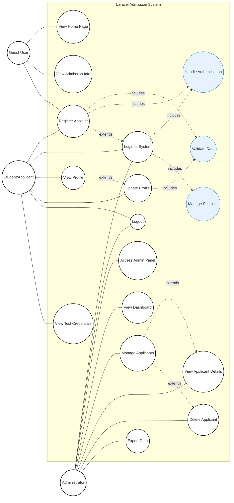
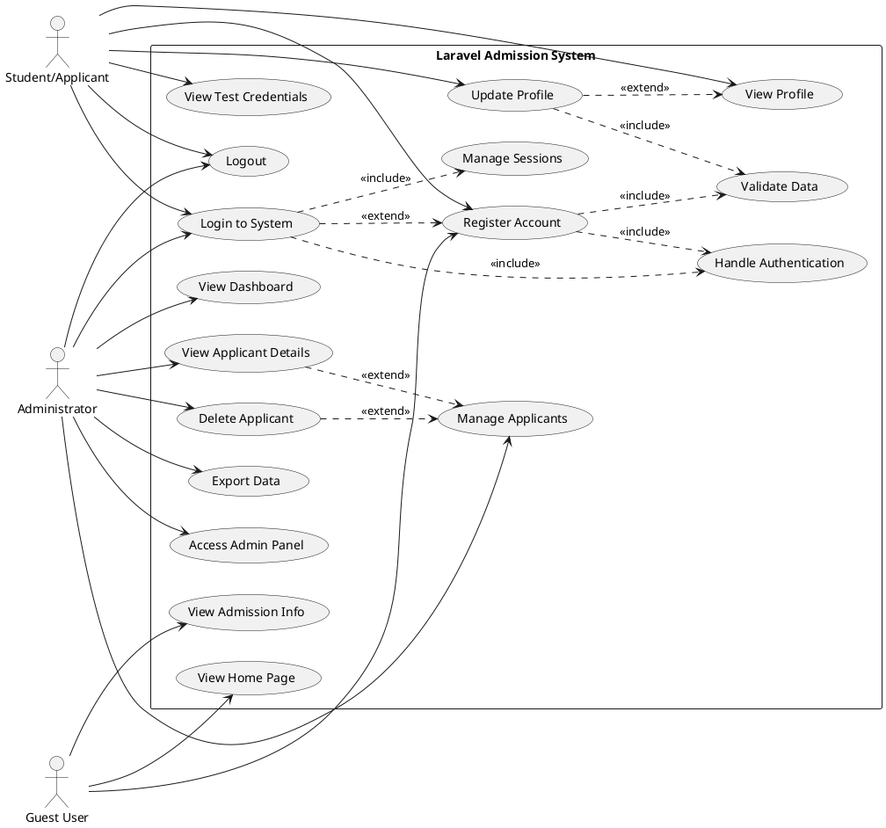

# Use Case Diagram - Laravel Admission System (Visual)

## Traditional UML Use Case Diagram



## Alternative: PlantUML Style Diagram



## How to Generate Visual Image

### Method 1: Online Mermaid Editor
1. Copy the mermaid code above
2. Go to https://mermaid.live/
3. Paste the code in the editor
4. Click "Download PNG" or "Download SVG"

### Method 2: VS Code Extension
1. Install "Mermaid Preview" extension in VS Code
2. Open this file in VS Code
3. Right-click on the mermaid block
4. Select "Export diagram" or "Preview"

### Method 3: GitHub/GitLab
1. Create a GitHub/GitLab issue or README
2. Paste the mermaid code in markdown
3. The diagram will render automatically
4. Take a screenshot

### Method 4: Command Line Tool
```bash
npm install -g @mermaid-js/mermaid-cli
mmdc -i use-case-diagram-visual.md -o use-case-diagram.png
```

## Simplified Actor-Use Case Matrix

| Use Case | Guest | Student | Admin |
|----------|-------|---------|-------|
| View Home Page | ✓ | ✓ | ✓ |
| View Admission Info | ✓ | ✓ | ✓ |
| Register Account | ✓ | ✓ | - |
| Login to System | - | ✓ | ✓ |
| View Profile | - | ✓ | - |
| Update Profile | - | ✓ | - |
| Logout | - | ✓ | ✓ |
| View Test Credentials | - | ✓ | - |
| Access Admin Panel | - | - | ✓ |
| View Dashboard | - | - | ✓ |
| Manage Applicants | - | - | ✓ |
| View Applicant Details | - | - | ✓ |
| Delete Applicant | - | - | ✓ |
| Export Data | - | - | ✓ |

## Key Features Highlighted

### 🔐 Authentication Flow
- **Registration Required**: Users must register before login
- **Auto-login**: Successful registration automatically logs in user
- **Session Management**: Proper login/logout functionality

### 👨‍💼 Administrative Features  
- **Admin Dashboard**: Overview of system statistics
- **Data Management**: View, delete, and export applicant data
- **User Management**: Complete CRUD operations

### 🎓 Student Features
- **Profile Management**: View and update personal information
- **Secure Access**: Phone number + last 4 digits authentication
- **Test Environment**: Demo credentials for testing

### 🌐 Public Access
- **Information Pages**: Home and admission information
- **Registration Portal**: Easy account creation process