# Use Case Diagram - Laravel Admission System

## System Overview
The Laravel Admission System is a web-based application for managing university admissions with user registration, authentication, and administrative functions.

## Use Case Diagram

```mermaid
graph TB
    %% Actors
    subgraph Actors
        Student[Student/Applicant]
        Admin[Administrator]
        Guest[Guest User]
    end

    %% System Boundary
    subgraph "Laravel Admission System"
        %% Guest Use Cases
        ViewHomePage[View Home Page]
        ViewAdmissionInfo[View Admission Information]
        AccessRegistration[Access Registration Page]
        
        %% Student Use Cases
        RegisterAccount[Register New Account]
        LoginSystem[Login to System]
        ViewProfile[View Personal Profile]
        UpdateProfile[Update Profile Information]
        LogoutSystem[Logout from System]
        ViewTestCredentials[View Test Credentials]
        
        %% Admin Use Cases
        AccessAdminPanel[Access Admin Panel]
        ViewDashboard[View Admin Dashboard]
        ManageApplicants[Manage Applicants]
        ViewApplicantDetails[View Applicant Details]
        DeleteApplicant[Delete Applicant]
        ExportData[Export Applicant Data]
        ViewStatistics[View Application Statistics]
        
        %% System Use Cases
        ValidateData[Validate Input Data]
        ManageSessions[Manage User Sessions]
        HandleAuthentication[Handle Authentication]
        StoreData[Store Data in Database]
    end

    %% Guest Relationships
    Guest --> ViewHomePage
    Guest --> ViewAdmissionInfo
    Guest --> AccessRegistration
    Guest --> RegisterAccount
    
    %% Student Relationships
    Student --> RegisterAccount
    Student --> LoginSystem
    Student --> ViewProfile
    Student --> UpdateProfile
    Student --> LogoutSystem
    Student --> ViewTestCredentials
    
    %% Admin Relationships
    Admin --> AccessAdminPanel
    Admin --> ViewDashboard
    Admin --> ManageApplicants
    Admin --> ViewApplicantDetails
    Admin --> DeleteApplicant
    Admin --> ExportData
    Admin --> ViewStatistics
    Admin --> LoginSystem
    Admin --> LogoutSystem
    
    %% Include Relationships
    RegisterAccount -.->|includes| ValidateData
    RegisterAccount -.->|includes| StoreData
    RegisterAccount -.->|includes| HandleAuthentication
    LoginSystem -.->|includes| HandleAuthentication
    LoginSystem -.->|includes| ManageSessions
    UpdateProfile -.->|includes| ValidateData
    UpdateProfile -.->|includes| StoreData
    
    %% Extend Relationships
    RegisterAccount -.->|extends| LoginSystem
    ViewProfile -.->|extends| UpdateProfile
    ManageApplicants -.->|extends| ViewApplicantDetails
    ManageApplicants -.->|extends| DeleteApplicant
    ViewDashboard -.->|extends| ViewStatistics
    
    %% System Internal Relationships
    HandleAuthentication --> ManageSessions
    ValidateData --> StoreData

    %% Styling
    classDef actor fill:#e1f5fe,stroke:#01579b,stroke-width:2px
    classDef usecase fill:#f3e5f5,stroke:#4a148c,stroke-width:1px
    classDef system fill:#e8f5e8,stroke:#1b5e20,stroke-width:2px
    
    class Student,Admin,Guest actor
    class ViewHomePage,ViewAdmissionInfo,AccessRegistration,RegisterAccount,LoginSystem,ViewProfile,UpdateProfile,LogoutSystem,ViewTestCredentials,AccessAdminPanel,ViewDashboard,ManageApplicants,ViewApplicantDetails,DeleteApplicant,ExportData,ViewStatistics usecase
    class ValidateData,ManageSessions,HandleAuthentication,StoreData system
```

## Detailed Use Case Descriptions

### 1. Guest User Use Cases

**UC1: View Home Page**
- **Actor**: Guest User
- **Description**: Browse the main landing page of the admission system
- **Preconditions**: None
- **Flow**: Access the homepage, view university information and navigation options

**UC2: View Admission Information**
- **Actor**: Guest User
- **Description**: Access detailed information about admission process
- **Preconditions**: None
- **Flow**: Navigate to admission page, view admission guidelines and requirements

**UC3: Access Registration Page**
- **Actor**: Guest User
- **Description**: Navigate to the registration/system page
- **Preconditions**: None
- **Flow**: Click on registration links, access the system page

### 2. Student/Applicant Use Cases

**UC4: Register New Account**
- **Actor**: Student/Applicant
- **Description**: Create a new account in the system
- **Preconditions**: User must not be logged in
- **Flow**: Fill registration form → Validate data → Store in database → Auto-login
- **Postconditions**: User account created and automatically logged in

**UC5: Login to System**
- **Actor**: Student/Applicant
- **Description**: Authenticate and access the system
- **Preconditions**: User must have registered account
- **Flow**: Enter phone number and password → Validate credentials → Create session
- **Postconditions**: User authenticated and can access protected features

**UC6: View Personal Profile**
- **Actor**: Student/Applicant
- **Description**: View personal information and registration details
- **Preconditions**: User must be logged in
- **Flow**: Access system page → Display user profile information

**UC7: Logout from System**
- **Actor**: Student/Applicant
- **Description**: End current session and logout
- **Preconditions**: User must be logged in
- **Flow**: Click logout → Clear session → Redirect to login page

### 3. Administrator Use Cases

**UC8: Access Admin Panel**
- **Actor**: Administrator
- **Description**: Access administrative interface
- **Preconditions**: Admin authentication required
- **Flow**: Navigate to /admin → Display admin dashboard

**UC9: View Admin Dashboard**
- **Actor**: Administrator
- **Description**: View system overview and statistics
- **Preconditions**: Admin access granted
- **Flow**: Display total applicants, recent registrations, and quick actions

**UC10: Manage Applicants**
- **Actor**: Administrator
- **Description**: View and manage all registered applicants
- **Preconditions**: Admin access granted
- **Flow**: Display applicant list → Sort/filter → Perform actions

**UC11: View Applicant Details**
- **Actor**: Administrator
- **Description**: View detailed information of specific applicant
- **Preconditions**: Admin access granted
- **Flow**: Select applicant → Display detailed modal/page

**UC12: Delete Applicant**
- **Actor**: Administrator
- **Description**: Remove applicant record from system
- **Preconditions**: Admin access granted
- **Flow**: Select applicant → Confirm deletion → Remove from database

**UC13: Export Applicant Data**
- **Actor**: Administrator
- **Description**: Export applicant data for external use
- **Preconditions**: Admin access granted
- **Flow**: Select export format → Generate file → Download

## System Requirements

### Functional Requirements
1. User registration with validation
2. Authentication system with session management
3. Profile management capabilities
4. Administrative interface for data management
5. Data export functionality
6. Responsive web interface

### Non-Functional Requirements
1. **Security**: Session-based authentication, CSRF protection
2. **Performance**: SQLite database for efficient data storage
3. **Usability**: Responsive design with TailwindCSS
4. **Reliability**: Laravel framework stability and error handling
5. **Maintainability**: MVC architecture with clear separation of concerns

### Technical Constraints
- PHP 8.2+ runtime environment
- Laravel 12.0 framework
- SQLite database
- Modern web browser compatibility
- TailwindCSS for styling
- Vite for asset compilation

## Database Entities
- **Applicants**: id, name, email, phone, birth_date, created_at, updated_at
- **Sessions**: Laravel session management
- **Administrative data**: Managed through Laravel framework

## Security Considerations
- Input validation and sanitization
- CSRF token protection
- Session management
- SQL injection prevention through Eloquent ORM
- Authentication verification for protected routes